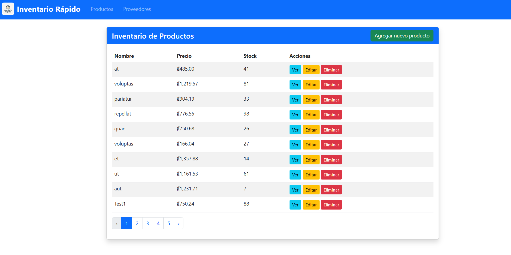

# Sistema de Inventario Laravel



Sistema web completo para la gestión de inventarios desarrollado con Laravel. Permite administrar productos, proveedores y categorías de manera eficiente y profesional.

## Características Principales

- **Gestión Completa de Productos**: CRUD completo con campos de nombre, descripción, precios de compra y venta, stock y categorización
- **Administración de Proveedores**: Sistema completo para gestionar información de proveedores
- **Categorización de Productos**: Organización por categorías para mejor control del inventario
- **Interfaz Responsive**: Diseño adaptable para dispositivos móviles y desktop
- **Arquitectura MVC**: Implementación siguiendo las mejores prácticas de Laravel

## Tecnologías Utilizadas

- **Backend**: PHP 8.0+, Laravel 9.x
- **Base de Datos**: MySQL/SQLite
- **Frontend**: Blade Templates, HTML5, CSS3
- **Arquitectura**: MVC (Model-View-Controller)
- **ORM**: Eloquent
- **Migrations & Seeders**: Para gestión de base de datos

## Estructura del Proyecto

### Controladores
- `ProductoController`: Gestión completa de productos
- `ProveedorController`: Administración de proveedores

### Modelos
- `Producto`: Modelo para productos con relaciones a categorías y proveedores
- `Proveedor`: Modelo para proveedores
- `Categoria`: Modelo para categorización de productos

### Rutas Principales
- `/productos` - Listado de productos
- `/productos/create` - Crear nuevo producto
- `/productos/{id}/edit` - Editar producto
- `/proveedores` - Listado de proveedores
- `/proveedores/create` - Crear nuevo proveedor
- `/proveedores/{id}/edit` - Editar proveedor

## Instalación

### Requisitos Previos
- PHP 8.0 o superior
- Composer
- MySQL o SQLite
- Servidor web (Apache/Nginx)

### Pasos de Instalación

1. **Clonar el repositorio**
```bash
git clone https://github.com/NikoCartin/InventarioRapidoLaravel.git
cd InventarioRapidoLaravel
```

2. **Instalar dependencias**
```bash
composer install
```

3. **Configurar el entorno**
```bash
cp .env.example .env
php artisan key:generate
```

4. **Configurar base de datos**
```bash
# Editar .env con tus credenciales de base de datos
DB_CONNECTION=mysql
DB_HOST=127.0.0.1
DB_PORT=3306
DB_DATABASE=inventario
DB_USERNAME=tu_usuario
DB_PASSWORD=tu_password
```

5. **Ejecutar migraciones**
```bash
php artisan migrate
```

6. **Ejecutar seeders (opcional)**
```bash
php artisan db:seed
```

7. **Iniciar servidor de desarrollo**
```bash
php artisan serve
```

## Uso del Sistema

### Gestión de Productos
- **Crear**: Agregar nuevos productos con información completa
- **Listar**: Ver todos los productos con paginación
- **Editar**: Modificar información de productos existentes
- **Eliminar**: Remover productos del inventario
- **Visualizar**: Ver detalles completos de cada producto

### Gestión de Proveedores
- **Crear**: Registrar nuevos proveedores
- **Listar**: Ver listado completo de proveedores
- **Editar**: Actualizar información de proveedores
- **Eliminar**: Remover proveedores del sistema

## Contribución

1. Fork el proyecto
2. Crear una rama para tu feature (`git checkout -b feature/nueva-funcionalidad`)
3. Commit tus cambios (`git commit -am 'Agregar nueva funcionalidad'`)
4. Push a la rama (`git push origin feature/nueva-funcionalidad`)
5. Abrir un Pull Request

## Licencia

Este proyecto está bajo la Licencia MIT.

## Contacto

- **Desarrollador**: Niko Cartin
- **GitHub**: [@NikoCartin](https://github.com/NikoCartin)